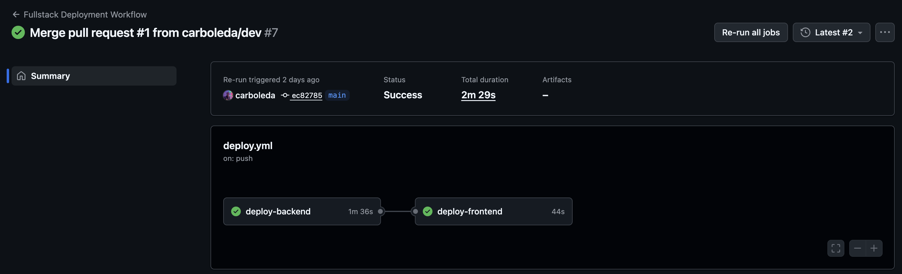

# Guru Finance

A full-stack serverless personal finance application for tracking income and expense transactions. Built with React on the frontend and AWS Lambda + DynamoDB on the backend, deployed via Vercel and Serverless Framework.

I really like personal finance matters and wanted to build a simple app to track my transactions and visualize my spending habits. This is a minimal version of another pet project I have called [Zolvent](https://github.com/carboleda/ai-money-tracker).


---

## Prerequisites

| Tool                         | Version                                    |
| ---------------------------- | ------------------------------------------ |
| Node.js                      | 24 (see `.nvmrc`)                          |
| npm                          | bundled with Node 24                       |
| Docker                       | any recent version (for local DynamoDB)    |
| AWS account                  | required for deployment                    |
| Serverless Framework account | required for deployment (`org: carboleda`) |

---

## Project Structure

```
aws-serverless-fullstack-app/
├── backend/          # Serverless Framework + AWS Lambda + DynamoDB
├── frontend/         # React 19 + Vite + TailwindCSS SPA
├── .github/
│   └── workflows/
│       └── deploy.yml   # CI/CD — deploys both layers on push
└── .nvmrc               # Node 24
```

- **[backend/README.md](./backend/README.md)** — architecture, DDD layers, API endpoints, deployment
- **[frontend/README.md](./frontend/README.md)** — component structure, state management, deployment

---

## Installation & Setup

### 1. Clone the repository

```bash
git clone <repo-url>
cd aws-serverless-fullstack-app
```

### 2. Install dependencies

```bash
# Backend
npm install --prefix backend

# Frontend
npm install --prefix frontend
```

### 3. Configure environment variables

Copy the provided templates and fill in your values:

```bash
# Backend
cp backend/.env.template backend/.env

# Frontend
cp frontend/.env.template frontend/.env
```

See the respective README files for the full variable reference:

- [Backend environment variables](./backend/README.md#environment-variables)
- [Frontend environment variables](./frontend/README.md#environment-variables)

---

## Local Development

The backend requires a local DynamoDB instance (Docker) before starting the dev server.

```bash
# Terminal 1 — start DynamoDB Local
npm run --prefix backend dynamodb:start

# Terminal 2 — start Lambda + API Gateway emulation (hot reload)
npm run --prefix backend dev

# Terminal 3 — start frontend dev server
npm run --prefix frontend dev
```

| Service               | URL                   |
| --------------------- | --------------------- |
| Frontend (Vite)       | http://localhost:5173 |
| API Gateway (offline) | http://localhost:3000 |
| DynamoDB Local        | http://localhost:8000 |

> The frontend `.env` must point `VITE_API_URL` at the offline API Gateway URL during local development.

---

## Deployment

Deployment is fully automated via GitHub Actions on every push to `main` or `dev`.

### How CI/CD works



1. **Backend** is deployed first via `serverless deploy --stage <stage>`.
2. The API Gateway URL is extracted from the deploy output.
3. **Frontend** is built with `VITE_API_URL` injected at build time, then deployed to Vercel.

Branch → stage mapping:

| Branch | Stage  | Frontend URL                            |
| ------ | ------ | --------------------------------------- |
| `dev`  | `dev`  | https://preview.guru-finance.calabs.dev |
| `main` | `prod` | https://guru-finance.calabs.dev         |

### Manual deployment

```bash
# Backend — deploy to dev
npm run --prefix backend deploy:dev

# Backend — deploy to prod
npm run --prefix backend deploy:prod

# Frontend — build and deploy via Vercel CLI
npm run --prefix frontend build

# deploy to Vercel preview environment
npm run --prefix frontend deploy:preview

# or

# deploy to Vercel production environment
npm run --prefix frontend deploy:prod
```

### Required GitHub secrets

| Secret                  | Description                              |
| ----------------------- | ---------------------------------------- |
| `AWS_ACCESS_KEY_ID`     | AWS credentials                          |
| `AWS_SECRET_ACCESS_KEY` | AWS credentials                          |
| `SERVERLESS_ACCESS_KEY` | Serverless Framework access key          |
| `VERCEL_TOKEN`          | Vercel deploy token                      |
| `VERCEL_ORG_ID`         | Vercel organisation ID                   |
| `VERCEL_PROJECT_ID`     | Vercel project ID                        |
| `VITE_DUMMY_USER_ID`    | Simulated user ID injected at build time |

GitHub variable:

| Variable     | Description                   |
| ------------ | ----------------------------- |
| `AWS_REGION` | AWS region (e.g. `us-east-2`) |

---

## Testing

Both layers have independent test suites. A helper script runs them together.

| Layer | Runner | Command |
| -------- | ------- | -------------------------------|
| Backend | Jest | `npm run --prefix backend test` |
| Frontend | Vitest | `npm run --prefix frontend test` |
| Both | bash | `bash scripts/run-tests.sh` |

See the individual README files for full details on test structure, configuration, and conventions:

- [Backend testing](./backend/README.md#testing)
- [Frontend testing](./frontend/README.md#testing)

---

## Quick Start Commands

```bash
# Local development (after setup)
npm run --prefix backend dynamodb:start   # start DynamoDB Local
npm run --prefix backend dev              # start backend (hot reload)
npm run --prefix frontend dev             # start frontend

# Type check
npm run --prefix backend typecheck
npm run --prefix frontend typecheck

# Lint frontend
npm run --prefix frontend lint

# Tests
bash scripts/run-tests.sh

# Deploy
npm run --prefix backend deploy:dev
npm run --prefix backend deploy:prod

# Tear down
npm run --prefix backend undeploy:dev
npm run --prefix backend undeploy:prod
```

## How would I improve on this project?

- Add user authentication (e.g. AWS Cognito) and associate transactions with user accounts.
- Implement filters and pagination for transaction lists.
- Add Zod schemas for request validation in Lambda functions.
- Add more detailed error handling and user feedback on the frontend.
- Implement more unit and e2e tests for both layers.
